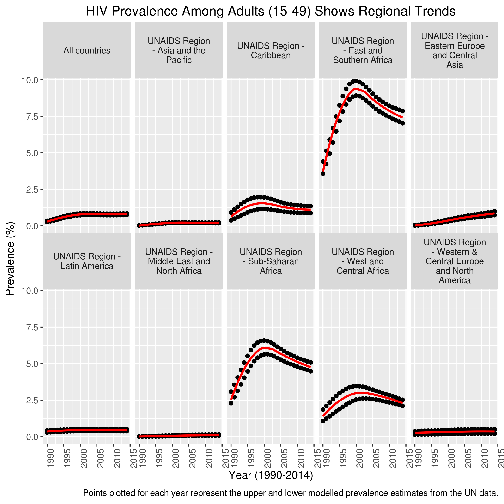
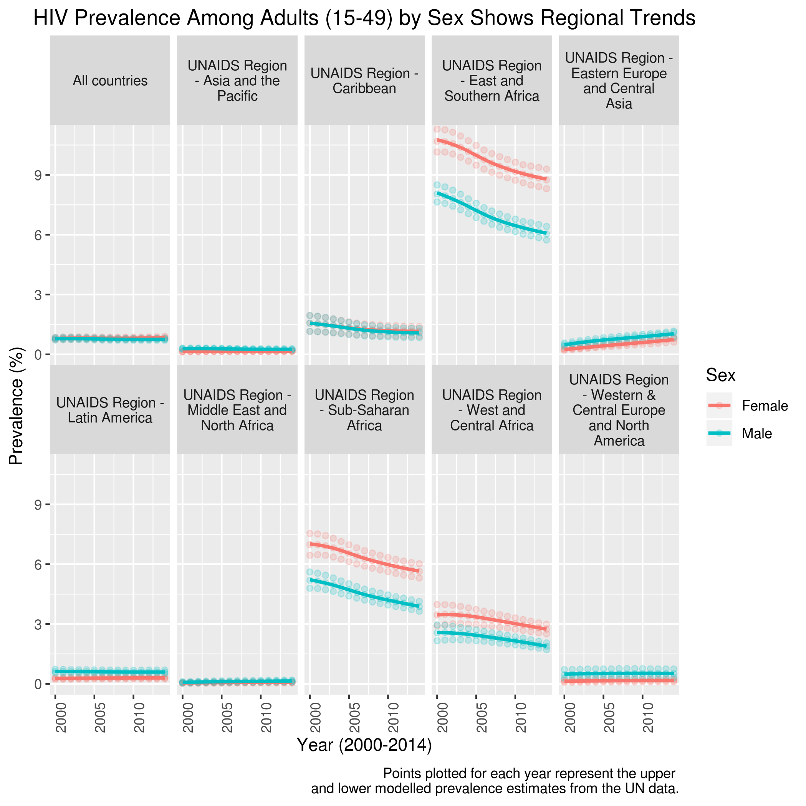
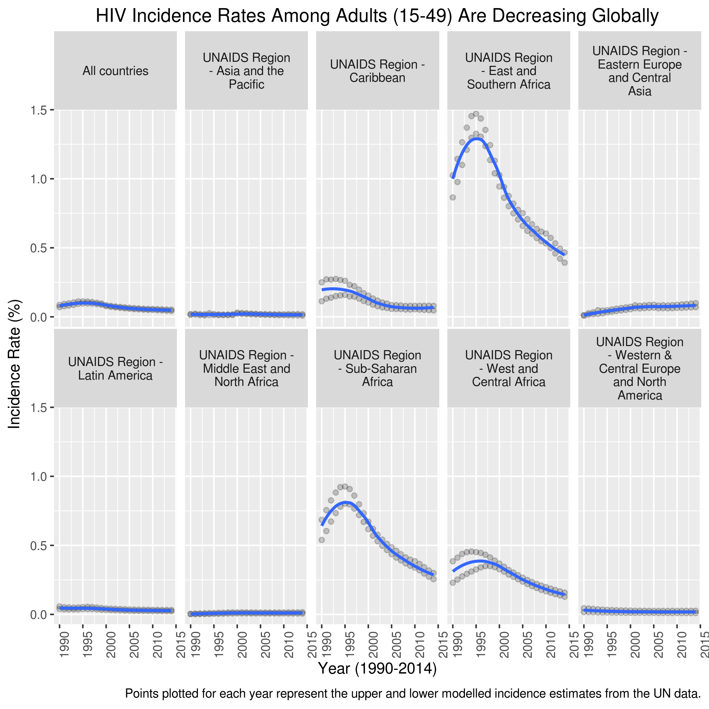
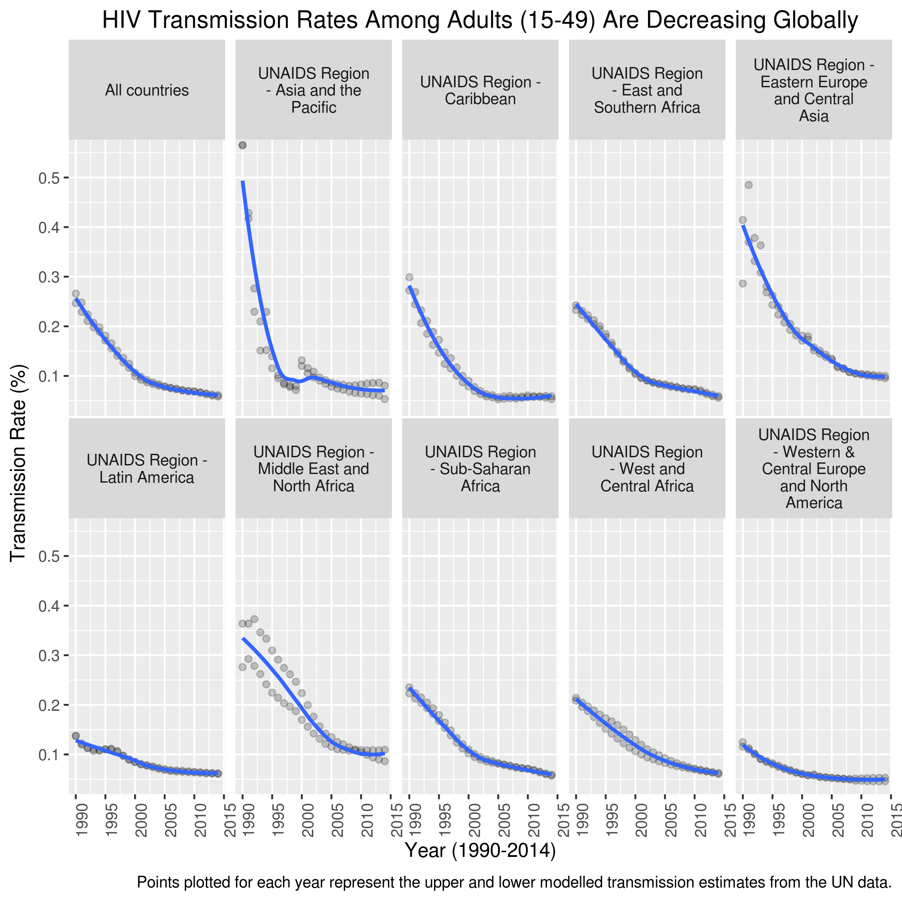
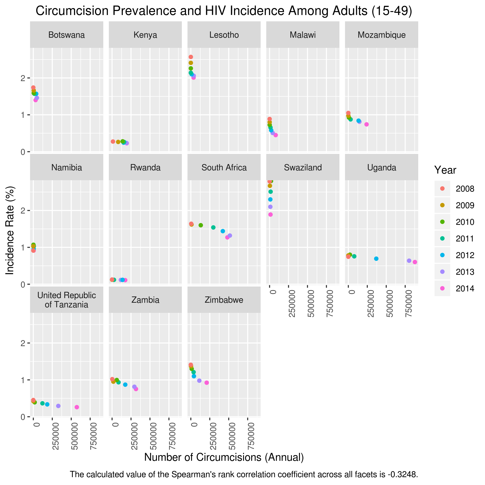
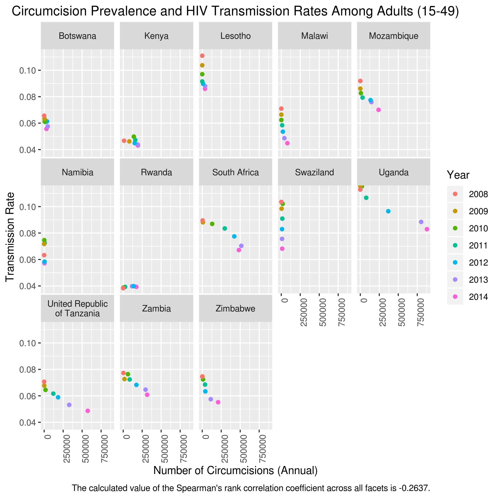
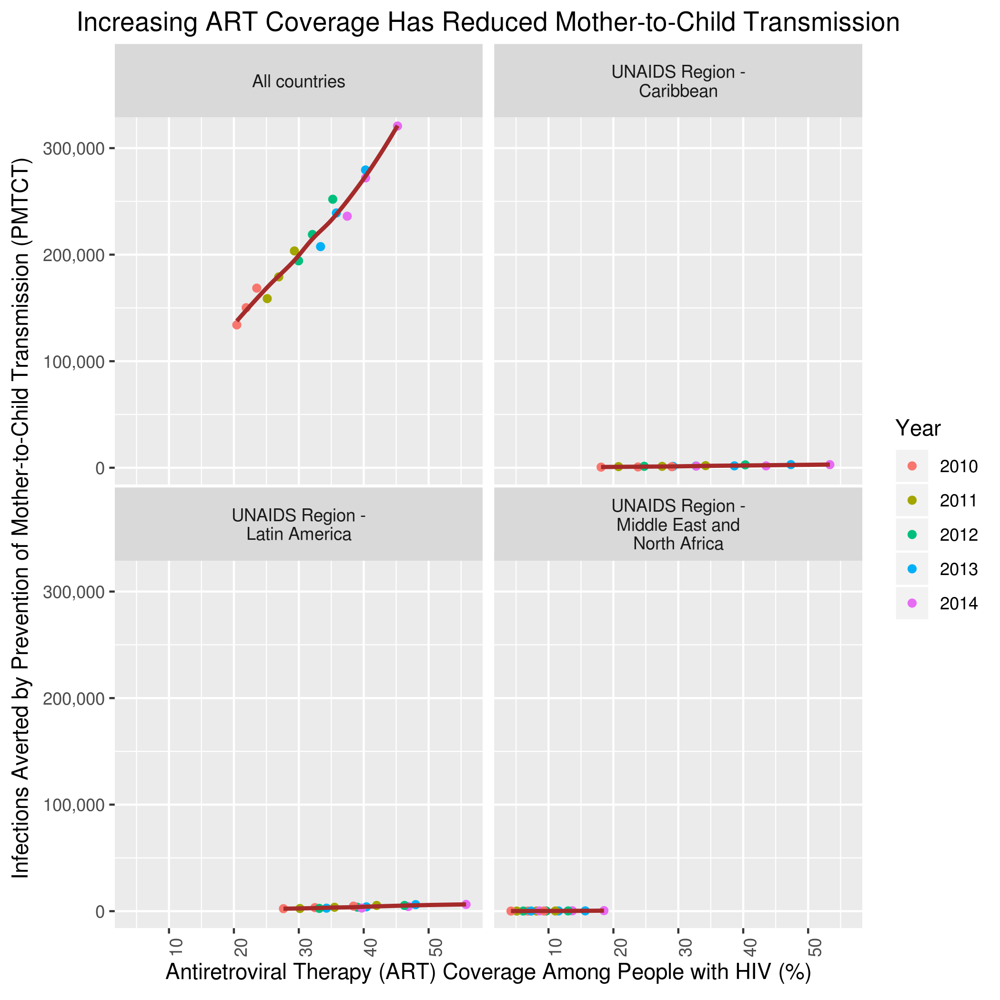

```{r setup, include=FALSE}
knitr::opts_chunk$set(echo = TRUE)
knitr::opts_knit$set(root.dir='./')

library(plyr)

library (tidyverse)

library(stringr)

#setwd("C:/Users/linra/Documents/UNC Masters Degree/Fall 2018/BIOS 611/Project 2")
```

The human immunodeficiency virus (HIV) is the virus that causes the spectrum of conditions known as acquired immune deficiency syndrome (AIDS). Identified in the 1980s, the virus has resulted in roughly 1 million deaths to date, with nearly 37 million people living with the infection. HIV is primarily spread by unprotected sex, contaminated blood, and mother-to-child transmission during pregnancy, delivery, or breastfeeding. As the infection progresses, HIV destroys $CD4^+$ T cells (and other cells expressing the $CD4^+$ surface protein, which is critical for signaling with other immune cells), greatly crippling the body's ability to respond to pathogens, and death usually results from a multitude of opportunistic infections.

HIV/AIDS is considered a pandemic, and many international efforts have arisen to combat the disease. The Joint United Nations Programme on HIV and AIDS (UNAIDS) is the main advocated for comprehensive, coordinated global action, with several ambitious targets and deadlines. One is the 90-90-90 target, which states that by 2020, 90% of all people living with HIV will know their HIV status. In addition, 90% of all people diagnosed will received sustained antiretroviral therapy (ART), and 90% of all people receiving ART will have viral suppression.

```{r, echo=FALSE}

```


The first area to examine when looking at the AIDS pandemic is to examine the prevalence of the disease, which is the proportion of a particular population found to be affected by a medical condition. Because there are hundreds of countries included in the UN dataset, this graph displays aggregate HIV prevalence for all countries, and for UN-specified AIDS regions. While the trend is relatively constant for the all countries group and most regions, the three regions that show the greatest prevalence are the African regions, which is not surprising, as HIV originated in west-central Africa. It is particularly noticeable that HIV/AIDS prevalence, especially in the three African regions and the Caribbean, started to decrease precipitously after around 1995. Why 1995? In that year, the protease inhibitor saquinavir became available to treat HIV, allowing highly active antiretroviral therapy (HAART) to become possible. Having multiple drugs available to treat the disease greatly reduced viral loads in infected people, reducing the likelihood of developing AIDS or infecting others.

Another noticeable trend is the increase in HIV/AIDS prevalence in the Eastern Europe and Central Asia region, which by the UN data, is the only region in the world that is experiencing an increase in the HIV pandemic. The spread is concentrated predominantly among important affected populations, particularly people who inject drugs (such as in Russia), and improvements have been threatened by conflict in the region (such as in Ukraine).

```{r,echo=FALSE}


```

The global prevalence data can also be broken down by sex. In most regions of the world, men are either equal to or slightly higher than women in disease prevalence. This may be attributed to the fact that men who have sex with men (MSMs) are more likely to acquire HIV than the general population, and men are more likely than women to use illicit drugs (including injections.) In contrast, women have a far higher prevalence of HIV/AIDS compared to men in the three African regions. Some research has suggested that part of this trend is behavioral or cultural, as women who are poorer or less-educated are significantly more likely to have HIV infection. Women may also be more susceptible to infection biologically too. For example, women have a greater mucosal surface area that could be exposed to pathogens during sex, and they are at greater risk of tissue injury. But in general, the trends that are present in HIV prevalence over time when segregated by sex reflect those when sex is removed.


```{r, echo=FALSE}

```

Incidence is a measure of the probability of occurrence of a given condition within a specified period of time. Here, it reflects the number of new cases during a time period and is an important statistic to consider for evaluating control of disease spread. Throughout the world, HIV incidence rates among adults are decreasing, with especially sharp decreases in the African regions. Since most of those infected with HIV live in Africa, changes in the prevalence or incidence of HIV/AIDS are particularly distinct in those regions.  A downward trend is especially noticeable after 1995, which again likely corresponds to the availability of HAART to treat HIV/AIDS. We also see an increase in HIV incidence in Central Asia and Eastern Europe, which reflects the increase in HIV prevalence. 

```{r, echo=FALSE}


```

In this graph, we plot the transmission rate of HIV/AIDS over time, and one way to evaluate the transmission rate is to take the ratio of the disease incidence:disease prevalence. Transmission reflects the passing of disease from an infected hose to another individual or group. Here, transmission rates have sharply declined over the 25-year period in all regions, which reflects a variety of scientific, medical, and cultural advancements. Not only is our understanding of the disease better, leading to better medical care, but people are more aware of the disease and its mechanisms. In addition, there is less (though still significant) stigma attached to the disease, and people are more willing to care for and interact with those affected.


```{r, echo=FALSE}


```

After looking at trends in the spread of the disease, it is worth looking further at the factors that affect the spread. One factor that is less often brought to the discussion is male circumcision. The majority of men who are HIV-positive are or have been infected through the penis, and epidemiological evidence shows that uncircumcised men are at a greater risk of infection compared to circumcised men. 

Most cases of HIV infection are believed to involve HIV binding initially to $CD4$ and $CCR5$ receptors on antigen-presenting cells in the genital and rectal mucosa. The inner mucosal surface of the penis is rich in antigen-presenting cells (specifically, Langerhans' cells), which makes it particularly susceptible to infection. The mechanisms of heterosexual intercourse expose the inner surface of the foreskin to other mucosal secretions, which provide a large area where HIV transmission could take place.

The circumcision data collected by the UN is not as vast as other data, so data is only available for 7 years and 13 countries. The circumcision data reflects the annual number of circumcisions for all ages, whereas the incidence rate reflects data for adults aged 15-49. However, this should be acceptable, as the presence or absence of the foreskin is relevant during sexual intercourse. Although the data is varyingly distributed in each country, a Spearman's rank correlation coefficient applied to all the data across all the countries available gives a negative value. The Spearman correlation is a nonparametric measure of monotonic relationships, whether linear or not, so the negative value at least suggests an opposing relationship between HIV incidence and number of circumcisions. Of course, there are many, many confounding factors involved.


```{r, echo=FALSE}


```

Here, the annual number of circumcisions is compared to the transmission rate of HIV/AIDS in the 13 countries. Again, the Spearman correlation is weakly negative.


```{r, echo=FALSE}


```

Finally, we look at pharmaceutical developments in the fight against HIV/AIDS, by examining the number of infections averted by prevention of mother-to-child transmission (PMTCT) and the percentage of people with HIV who are covered by antiretroviral therapy (ART). The data for all countries clearly shows a strong, positive linear correlation between ART coverage and PMTCT. The fact that the trend seems mostly flat in the other displayed regions suggests that most of this benefit would likely appear in the African regions, where most people who are infected with HIV live. The reasoning for this trend is also very clear. Prompt, sustained ART greatly diminishes the probability that HIV will develop and result in AIDS. By reducing viral load, the possibility of transmission is much lower too. The advancements in such therapy mean that infected mothers can much more safely care for their children, such as through breastfeeding, which in turn greatly improves the likelihood of healthy childhood development.
